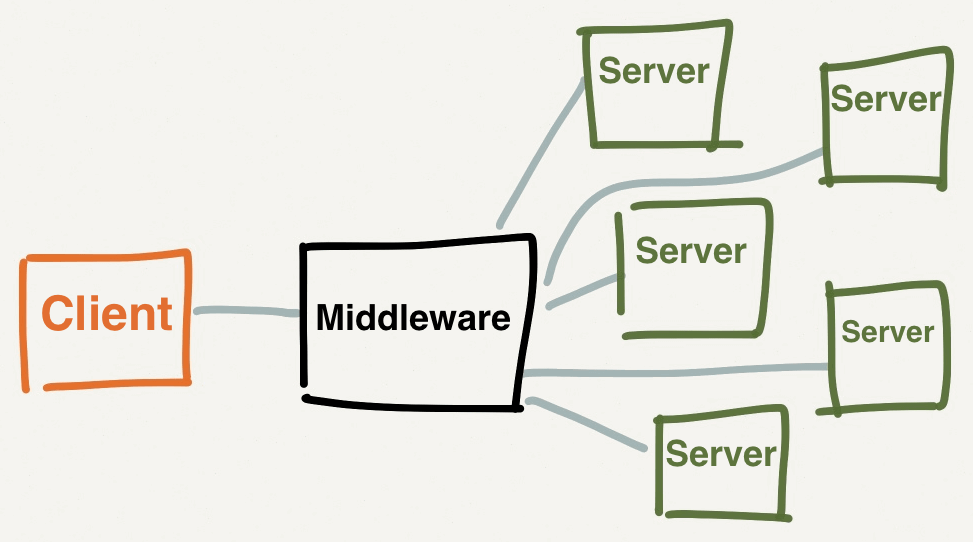
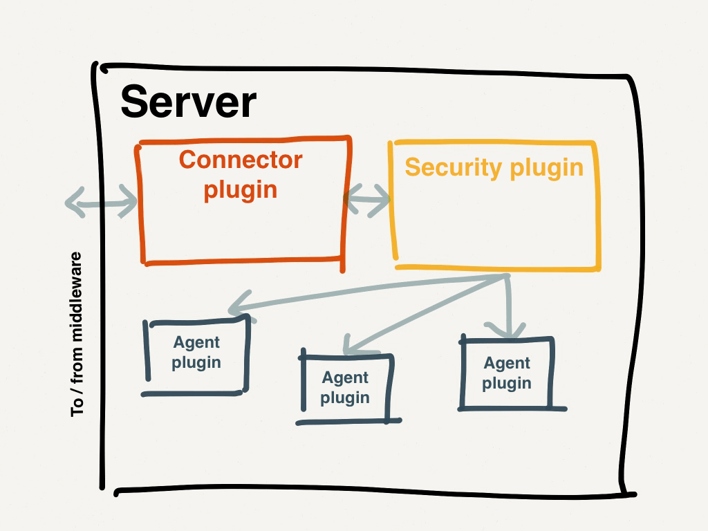
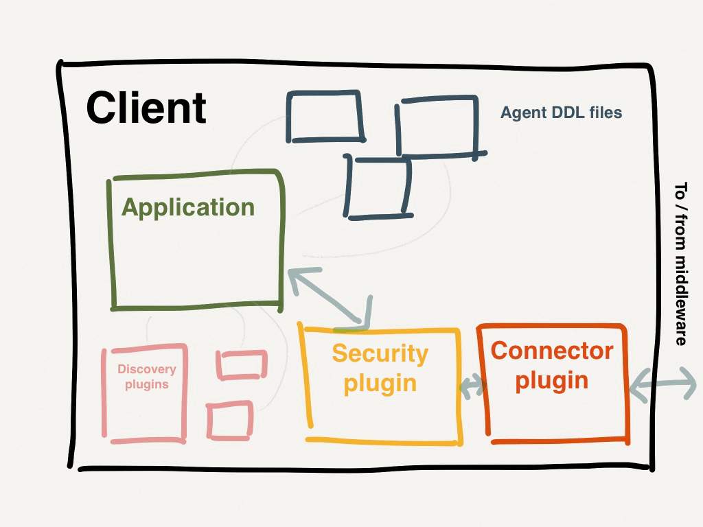
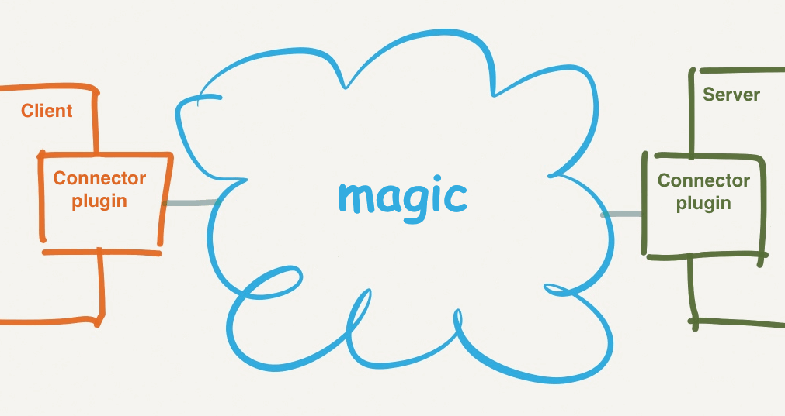

[ddl]: /mcollective/reference/plugins/ddl.html
[middleware]: /mcollective/deploy/middleware/
[standard_deploy]: /mcollective/deploy/standard.html
[agents]: /mcollective/simplerpc/agents.html
[subcollectives]: /mcollective/reference/basic/subcollectives.html
[actionpolicy]: http://projects.puppetlabs.com/projects/mcollective-plugins/wiki/AuthorizationActionPolicy
[ssl_plugin]: /mcollective/reference/plugins/security_ssl.html
[psk_plugin]: /mcollective/configure/server.html#psk-plugin-settings
[aes_plugin]: /mcollective/reference/plugins/security_aes.html

> This page is informational, not practical. It describes MCollective's components and global configuration.
>
> * For an overview of deployment topics, see [the deployment index page](/mcollective/deploy/index.html).
> * To try MCollective now, see the [Vagrant demo toolkit](/mcollective/deploy/demo.html).
> * To deploy MCollective into your production environment, see the [standard deployment getting started guide](/mcollective/deploy/standard.html).

The MCollective Components
-----

The architecture of MCollective is based around three main components: **servers,** **clients,** and the **middleware.** Servers and clients also use various sub-components, which are mentioned in their respective sections.

> **Terminology notes:**
>
> If you're familiar with Puppet, note that MCollective uses the term "server" a bit differently.
>
> * Instead of thinking "web server" or "puppet master server," think "SSH server." These are machines that mainly perform some other business purpose, but are also listening for MCollective requests.
> * From the user's perspective, servers accept inbound requests and react to them. From the middleware's perspective, servers are just another kind of client --- they proactively initiate a connection and subscribe to the types of messages they care about.
>
> The term "agent" is also different. In Puppet, the agent is a daemon that fetches and applies configurations --- the equivalent of the `mcollectived` server daemon. In MCollective, an agent is just a **bundle of actions** distributed as a plugin.
>
> Thing                                         | Puppet              | MCollective
> ----------------------------------------------|---------------------|-----------------------------
> Service that makes changes to the system      | puppet agent        | `mcollectived` server daemon
> Plugins that enable new actions/functionality | types and providers | agent plugins

### Servers

An MCollective server (often just called a "node") is a computer which **can be controlled via MCollective.** Servers run the MCollective daemon (`mcollectived`), and have any number of **agent plugins** installed.

The `mcollectived` service uses several kinds of plugin:

* A **connector plugin** to connect to the middleware and poll it for requests (and send replies)
* A **security plugin** to validate and filter those requests (and encode replies)
* Several **agent plugins** to execute actions from requests

The connector and security plugins are mandatory, and the clients must use the same ones as the servers.

Optionally, servers might also use:

* A **registration plugin** to send a heartbeat and metadata to some kind of inventory database
* **Data plugins** to enable more complicated request filtering
* An **authorization plugin** to authorize requests on a per-action basis
* An **audit plugin** to log all requests, centrally or locally

### Clients

An MCollective client can send requests to any number of servers, using a security plugin to encode and sign the request and a connector plugin to publish it. (These plugins have to match the security and connector used by the servers.) It can also receive replies from servers, and format the response data for a user or some other system.

The most common client is the `mco` command-line client, which can be used interactively or in scripts. It's also relatively easy to write other clients in Ruby, which can be used as backends for GUI apps or as glue in a reactive infrastructure of some kind.

Like servers, clients use several kinds of plugin:

* A **connector plugin** to connect to the middleware and send requests (and subscribe to replies)
* A **security plugin** to validate and filter those requests (and encode replies)
* Several **agent plugin DDL files** for constructing valid requests

(As mentioned above, servers use **agent plugins** to execute actions. Since clients request these actions, they need to know which actions are available and what kinds of arguments they require. To do this, they use the [DDL file][ddl] from each agent they care about. These files describe actions and their inputs to enable early validation, and also tell the client how to format and summarize responses for the user.)

Optionally, clients might also use:

* Extra **discovery plugins** to get lists of which server nodes will respond to a request (The default discovery method uses empty MCollective messages to find nodes, and querying a central database can sometimes be faster.)
* **Validator** and **aggregate** plugins for checking and formatting data (These can be referenced by the agent DDL files.)
* **Application plugins** to add custom subcommands to the `mco` command

### Middleware

MCollective clients and servers don't communicate directly: they expect to be connected to some middleware system that knows how to route messages. They then publish messages to the middleware, and subscribe to messages they are interested in.

This middleware system is external to MCollective, and everything that interacts directly with it is pushed out into a **connector plugin** (which needs some limited knowledge about the topology and configuration of the middleware). As far as everything but the connector is concerned, the middleware is an abstract cloud of magic:

The connector and middleware handle three main kinds of messages:

* **Broadcast** requests (client-to-server)
* **Directed** requests (client-to-server)
* **Replies** (server-to-client)

[See the middleware overview page][middleware] for info about the most common middleware options.

Global Configuration and Deployment Decisions
-----

Some MCollective configuration is global, and must match for all components. Deploying will be easier if you figure this configuration out first.

The [standard deployment guide][standard_deploy] makes several of these decisions for you, and goes into greater detail about the rest.

The main kinds of shared configuration are:

* Middleware type and connector
* Security plugin
* Agent plugins
* Subcollectives
* Authorization policies

### Middleware Type and Connector

All servers and clients must be using the same connector plugin, and it must match the middleware type you've chosen for the deployment.

* [Middleware Options][middleware]

Additionally, the way your middleware is configured will usually dictate some extra settings for the connector plugin. These generally include:

* Hostname(s) and port(s)
* Username and password
* Whether to use SSL
* SSL credentials (if using CA verification)

### Security Plugin

All servers and clients must be using the same security plugin. If it requires credentials for authentication, the servers will have to be configured to accept the clients' credentials (and vice-versa). Each security plugin has its own requirements re: credentials and their distribution.

* [The SSL security plugin (recommended)][ssl_plugin]
* [The PSK security plugin (only recommended for demo environments)][psk_plugin]
* [The AES security plugin (only recommended in special cases)][aes_plugin]

### Agent Plugins

MCollective servers need [agent plugins][agents] in order to do anything. Not every server needs the same set, but clients will need the agent DDL files for any agent they want to trigger actions from. This means you'll need central knowledge of what agents are in use.

### Subcollectives

If you're dividing your site into [subcollectives][] for security or traffic reduction, the list of collectives (and the business rules for which nodes use which) is another piece of global configuration.

* Servers and clients need to know which collectives they should subscribe to and send requests to, and their expectations need to be aligned. (If you send requests on a subcollective no one else knows about, you won't get anything interesting back.)
* The middleware will need to know about them as well, since subcollectives are implemented in the connector plugin. See [the configuration help for your specific middleware][middleware] --- you'll probably want to either limit certain users from accessing some collectives or prevent certain traffic from crossing inter-datacenter connections, and these restrictions have to be configured in the middleware itself rather than in MCollective.

### Authorization Policies

If you are using an authorization plugin like [ActionPolicy][], you'll need to configure its policies appropriately on every server. The rules for the policies must match the unique identities of the clients that will be sending requests, so the policies will be tied to your central knowledge of who and what the clients are.

With the ActionPolicy plugin, all policy files can safely be distributed to all servers, since each one defines which servers its rules apply to based on facts and other metadata.
